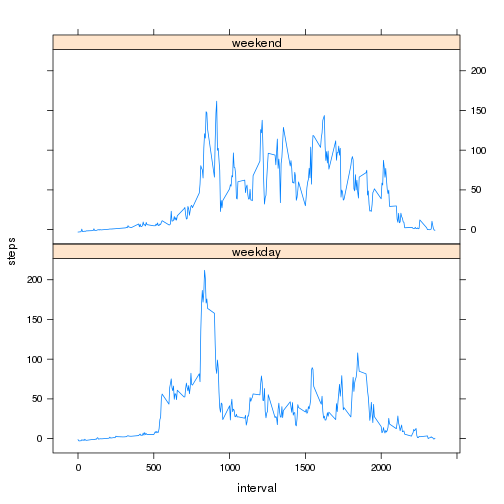

# Reproducible Research: Peer Assessment 1


## Loading and preprocessing the data

```r
unzip("activity.zip")
activity <- read.csv("activity.csv")
```


## What is mean total number of steps taken per day?

The distribution of steps taken for sampled days is shown in the histogram below.

```r
daily.agg <- aggregate(steps ~ date, activity, FUN = sum)
hist(daily.agg$steps, xlab = "Steps per day")
```

 


```r
options(scipen = 99)
print(steps.mean <- mean(daily.agg$steps))
```

```
## [1] 10766
```

```r
print(steps.median <- median(daily.agg$steps))
```

```
## [1] 10765
```


The mean number of steps taken was 10766.1887, and median was 10765.

## What is the average daily activity pattern?

We can also look at the average steps taken for each interval as a time series.

```r
interval.agg <- aggregate(steps ~ interval, activity, FUN = mean)
plot(steps ~ interval, interval.agg, type = "l", main = "Steps taken over intervals throughout the day")
```

 


```r
interval.max <- interval.agg[interval.agg$steps == max(interval.agg$steps), 
    ]
interval.max
```

```
##     interval steps
## 104      835 206.2
```

The maximum average steps 206.1698 occured at interval 835.

## Imputing missing values

Number of missing values:

```r
sum(is.na(activity$steps))
```

```
## [1] 2304
```

We can then build a loess curve to estimate missing values using interval.

```r
model <- loess(steps ~ interval, activity)
imputed_values <- predict(model, activity[is.na(activity$steps), ], type = "response")
activity[is.na(activity$steps), ]$steps <- imputed_values
```


New metrics after imputing missing values:

```r
daily.agg <- aggregate(steps ~ date, activity, FUN = sum)
hist(daily.agg$steps, xlab = "Steps per day")
```

 


Mean steps per day after imputing missing values:

```r
mean(daily.agg$steps)
```

```
## [1] 10769
```


Median steps per day after imputing missing values:

```r
median(daily.agg$steps)
```

```
## [1] 10788
```


## Are there differences in activity patterns between weekdays and weekends?


```r
library(lattice)
library(plyr)
activity$Weekend <- as.factor(weekdays(as.Date(activity$date)) %in% c("Saturday", 
    "Sunday"))
activity$Weekend <- revalue(activity$Weekend, c(`FALSE` = "weekday", `TRUE` = "weekend"))
interval.agg <- aggregate(steps ~ interval + Weekend, activity, FUN = mean)

xyplot(steps ~ interval | Weekend, interval.agg, layout = c(1, 2), type = "l")
```

 

